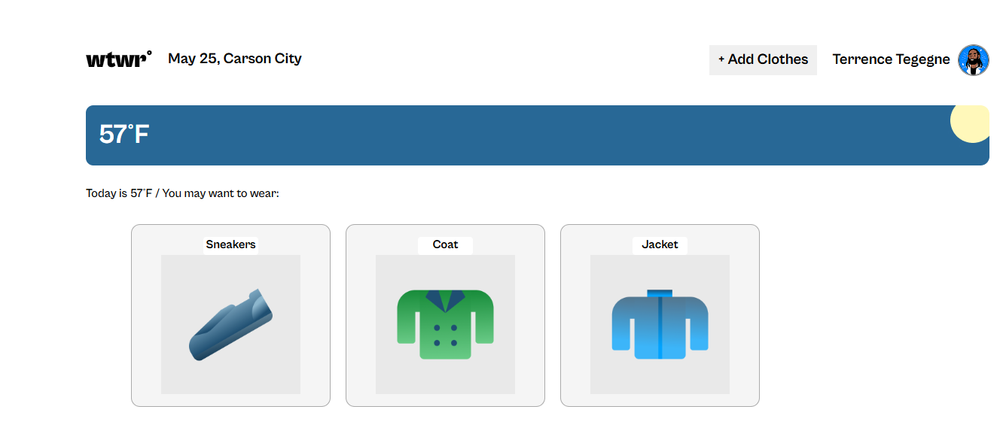
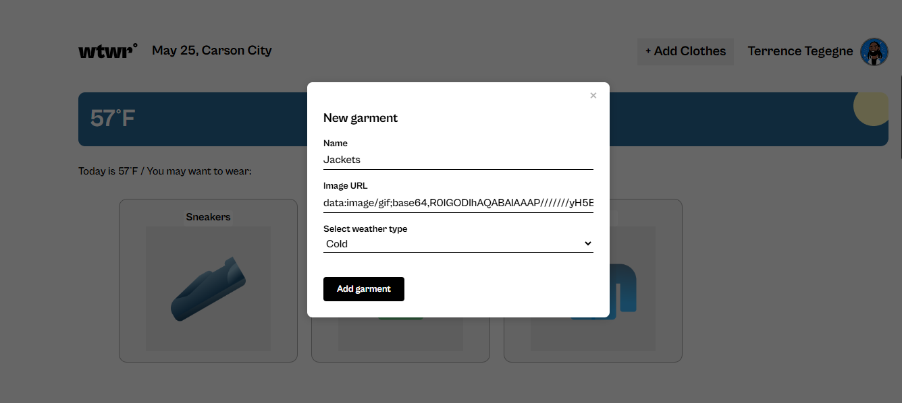
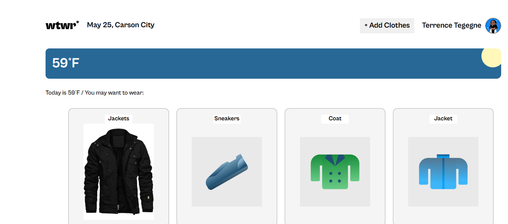
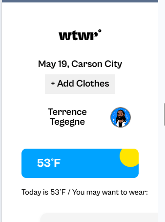
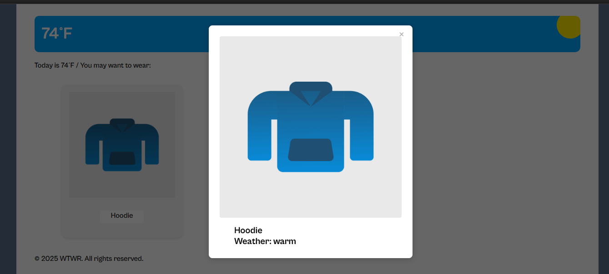

# 👗 WTWR — Frontend (React + Vite)

What to Wear (WTWR) is a weather‑aware clothing suggestions app. The frontend fetches live weather and displays recommended items from your API.

## ✨ Features
- Real‑time weather by city/coords
- Temperature‑based clothing recommendations
- Interactive item cards + modals
- Clean, responsive UI

## 🧰 Tech Stack
- **React 18** + **Vite**
- **React Router DOM**
- **normalize.css**
- Deployment via **gh-pages**

---

## 📦 Project Structure
```
se_project_react/
├─ public/                      # Static assets
├─ src/
│  ├─ components/               # Reusable UI
│  ├─ pages/                    # Route-level views
│  ├─ contextStore/             # React context
│  ├─ blocks/                   # CSS (BEM)
│  ├─ utils/
│  │  ├─ weatherApi.js          # OpenWeather calls
│  │  └─ clothingApi.js         # Backend item calls
│  ├─ App.jsx
│  └─ main.jsx
├─ .env.example                 # Example env vars
├─ index.html
├─ package.json
├─ vite.config.js
└─ README.md
```

## 🔐 Environment Variables
Create a `.env` in the project root:

```
# Required
VITE_APP_WEATHER_API_KEY=your_openweather_api_key

# Optional override for backend; defaults to http://127.0.0.1:3001 on localhost
VITE_API_BASE_URL=https://your-backend.example.com
```

> The app auto‑detects localhost and uses `http://127.0.0.1:3001` for the API unless you set `VITE_API_BASE_URL`.

---

## 🚀 Getting Started

```bash
# 1) Install
npm install

# 2) Run JSON server (only if you use the mock)
npm run server

# 3) Start the dev server
npm run dev
```

- Frontend: **http://localhost:5173**
- JSON Server (mock): **http://localhost:3001**

### Using the Express backend (recommended for Sprint‑12)
- Start your backend on **http://127.0.0.1:3001**
- Ensure CORS allows `http://localhost:5173` (or set `VITE_API_BASE_URL` to your deployed API)

---

## 📜 NPM Scripts
| Script            | What it does                                   |
|-------------------|-------------------------------------------------|
| `npm run dev`     | Start Vite dev server with HMR                  |
| `npm run build`   | Build production assets                         |
| `npm run preview` | Preview the production build locally            |
| `npm run lint`    | Lint with ESLint                                |
| `npm run server`  | Start JSON Server mock API on port 3001         |
| `npm run deploy`  | Deploy to GitHub Pages                          |

---

## 🌐 APIs Used
- **OpenWeatherMap** — current weather data
- **WTWR Backend API** — clothing items CRUD (local or deployed)

---

## 🔎 Troubleshooting
- **CORS errors**: If requests include cookies, the backend must not send `*` for `Access-Control-Allow-Origin`. Use explicit origins.
- **Unexpected end of JSON input** on GET: Don’t send a JSON body with GET requests in Postman.
- **Weather not loading**: Verify `VITE_APP_WEATHER_API_KEY` and check browser console.

---

* 🌐 APIs

   OpenWeatherMap API – Supplies current weather data by city name to power outfit suggestions

## 📸 Images





<!-- Add screenshots of your UI here --> <!-- Example:  -->


## Take a Look at the Project

click [here](https://FHobbs8030.github.io/se_project_react)


## 🎥 Demo Video

<!-- Add a hosted video link here --> <!-- Example: [Watch the Demo](https://your-video-link.com) -->

## 🔐 Environment Variables

To run the app locally, you’ll need to create a .env file in your root directory with the following variable:

VITE_APP_WEATHER_API_KEY=your_api_key_here

## 📦 Setup Instructions

To get started with the project locally:

* Clone the repo and navigate to the project folder

* Create a .env file at the root level

* Copy contents from .env.example (if available)

* Replace the placeholder value with your OpenWeatherMap API key

* Ensure .env is listed in your .gitignore file to keep your key safe

## 📄 License
MIT
